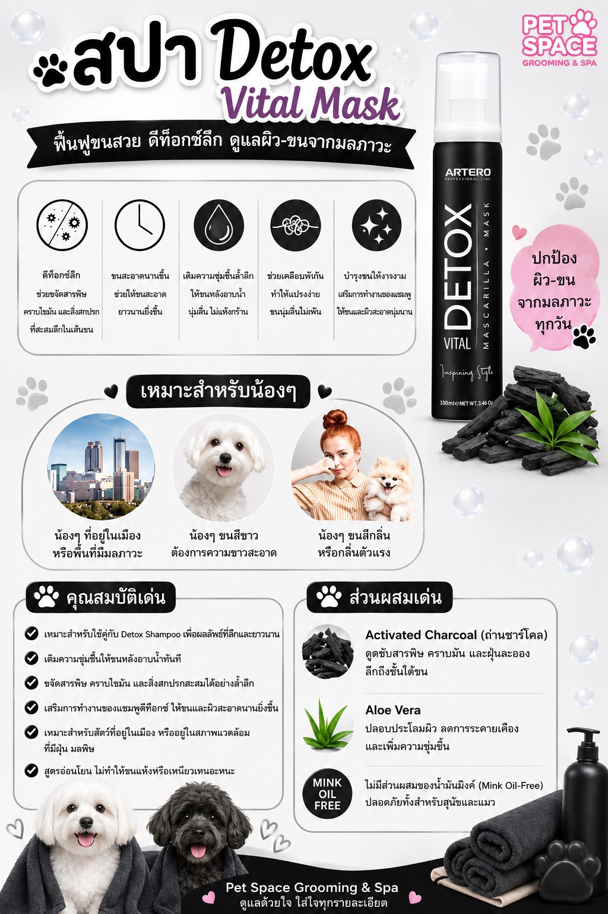

# คู่มือโพสต์บทความ SEO (สำหรับ ll-marketing)

ระบบบล็อกของ Pet Space ออกแบบให้ **เขียนไฟล์ markdown 1 ไฟล์ = 1 บทความ** แล้วสั่ง publish ครั้งเดียวจบ ระบบจะสร้างหน้า HTML + ใส่ SEO/JSON-LD + อัปเดตหน้ารวม + sitemap ให้อัตโนมัติ

## ขั้นตอนโพสต์ (3 สเต็ป)

1. สร้างไฟล์ใหม่ที่ `content/articles/<ชื่อ-slug>.md` (ชื่อไฟล์เป็นภาษาอังกฤษ ใช้ `-` คั่น เช่น `cat-nail-trim-tips.md`)
2. เขียนเนื้อหาตามรูปแบบด้านล่าง
3. รันคำสั่งเดียว:
   ```bash
   bash scripts/publish.sh
   ```
   (build + push GitHub + deploy Vercel อัตโนมัติ — ต้องมี `VERCEL_TOKEN` ใน env)

> ถ้าต้องการแค่ทดสอบไม่ deploy ให้รัน `node scripts/build-blog.js` แล้วเปิดไฟล์ `blog.html` ดู

## รูปแบบไฟล์บทความ

```markdown
---
title: หัวข้อบทความ (มี keyword หลัก + ย่านบางพลี/สมุทรปราการ)
description: คำโปรย 1 ประโยค สำหรับ meta description (120–155 ตัวอักษร)
slug: url-ของบทความ-เป็นอังกฤษ
date: 2026-07-11
category: ดูแลสุนัข
keywords: keyword1, keyword2, keyword3
cover: ../S__39755816_0.jpg   # (ไม่บังคับ) รูปหน้าปก อ้างจาก root ด้วย ../
---

ย่อหน้าเปิด เกริ่นปัญหา/คำถามของเจ้าของสัตว์

## หัวข้อย่อย (H2)

เนื้อหา... รองรับ **ตัวหนา**, [ลิงก์](../dog-grooming.html), และ

- รายการ bullet
- อีกข้อ

### หัวข้อย่อยรอง (H3)

> ข้อความ blockquote สำหรับเน้น


```

## กติกาเขียนให้ปัง SEO (สำคัญ)

- **1 บทความ = 1 keyword หลัก** ใส่ใน title, ย่อหน้าแรก และ H2 อย่างน้อย 1 ครั้ง
- ใส่ **ชื่อย่านเสมอ**: บางพลี / บางพลีใหญ่ / กิ่งแก้ว / หนามแดง / สมุทรปราการ / บางนา / สุวรรณภูมิ
- ความยาว **600–1,000 คำ** ขึ้นไป, มี H2 อย่างน้อย 3 หัวข้อ
- ใส่ **internal link** ไปหน้าบริการที่เกี่ยวข้องอย่างน้อย 2 จุด:
  - `[อาบน้ำ ตัดขนสุนัข](../dog-grooming.html)`
  - `[อาบน้ำแมว](../cat-grooming.html)`
  - `[สปา ARTERO](../spa.html)`
  - `[โรงแรม/รับฝากเลี้ยง](../pet-hotel.html)`
  - `[ติดต่อ/จองคิว](../contact.html)`
  - ลิงก์ระหว่างบทความด้วยกันใช้ชื่อไฟล์ตรงๆ เช่น `[อ่านต่อ](how-often-bath-dog.html)`
- **ห้ามแต่งราคา/ข้อมูลเท็จ** ถ้าจะพูดถึงราคาให้ลิงก์ไปหน้าบริการแทน
- ปิดท้ายด้วย CTA ชวนทัก LINE/จองคิว (ระบบมีกล่อง CTA ให้อัตโนมัติท้ายบทความอยู่แล้ว)
- รูปที่ใช้ได้ในโปรเจกต์ (อ้างด้วย `../`): `S__39755816_0.jpg` (เมนูสุนัข), `S__39755817_0.jpg` (เมนูแมว), `S__39755819_0.jpg` (โปรสปา), `S__39755820_0.jpg` (Protein), `S__39755821_0.jpg` (Detox), `S__39755822_0.jpg` (Keratin), `storefront-1.jpg`, `storefront-2.jpg`, `S__39755831_0.jpg` (แบนเนอร์)

## ไอเดียหัวข้อ ( backlog)

- ตัดขนพุดเดิ้ลทรงไหนดี? รวมทรงยอดฮิต Toy/Miniature/Standard
- อาบน้ำแมวขนยาวบ่อยแค่ไหน + วิธีดูแลไม่ให้ขนพัน
- เตรียมน้องหมาก่อนฝากโรงแรมสัตว์เลี้ยงช่วงวันหยุดยาว
- 5 สัญญาณว่าน้องหมาถึงเวลาต้องตัดเล็บ
- สังกะตังคืออะไร ป้องกันยังไง
